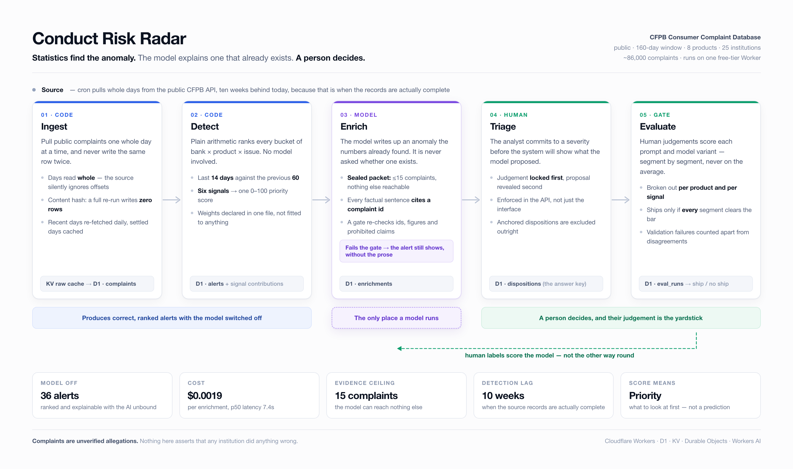

# I built an AI system that finds bad patterns in bank complaints. The most important design decision was keeping the AI out of the decision.

Every year, hundreds of thousands of people in the US file a complaint about a bank, a credit card, a loan, or a payment app. The government publishes them. Anyone can download them. They are free.

And almost nobody can use them.

Not because the data is secret, but because it is enormous and shapeless. If you are the person at a bank whose job is to spot problems early — a wave of frozen accounts, a fee nobody understands, a new product going wrong in one region — you are looking at a firehose. Roughly 400 complaints a day land in the slice I looked at, and that slice is a small fraction of the whole database.

So I built something to answer one deliberately small question: **out of everything happening this month, what should a human look at first?**

I called it Conduct Risk Radar. It runs on a free hosting tier and costs about a fifth of a cent per case it writes up. Here is what it does, how it works, and — more usefully — what it refuses to do.

---

## The tempting answer, and why it's wrong

The obvious 2026 approach is: feed every complaint to a large language model, ask "which of these look risky," and read the output.

That fails in a specific and expensive way. A language model will always give you an answer. Ask it which bank looks worst and it will tell you, fluently, with confidence, and with no way for you to check whether it made the whole thing up. In a regulated environment, an answer you can't verify isn't a weak answer. It's a liability.

The other failure is subtler. If the model reads a complaint about a bank and calls it "high risk," what does that mean? Risk of what? Compared to what? Nobody agreed on a scale, so the number means nothing — but it looks like it means something, which is worse.

So I inverted the design.

---

## The method: statistics find it, AI explains it, a human decides

Four jobs, and each one goes to whoever is actually good at it.

**1. Statistics find the anomaly.** Not AI. Plain arithmetic.

The system chops the world into small buckets — one bank, one product, one type of issue. "Chase, checking accounts, problems with a deposit," for example. Then, for each bucket, it compares the last two weeks against the previous two months and asks six ordinary questions:

- Are complaints up, and up by more than normal wobble would explain?
- Is one type of issue growing faster here than it's growing across the whole market?
- Is the bank taking longer to respond than it used to?
- Are more responses arriving late?
- Are more cases closing with the customer getting nothing?
- Are complaints suddenly clustering in one state?

Each question produces a number from 0 to 100. The six are combined into one score, also 0 to 100, using weights I chose and wrote down in a single file with my reasoning next to them. Anyone can disagree with the weights — that's the point of writing them down.

**Crucially: this whole layer works with the AI switched off.** The alerts, the ranking, the queue — all of it exists and is correct with no model in the loop. That's not a fallback. It's the foundation.

**2. AI explains an anomaly that already exists.**

Only once the arithmetic has flagged something does a language model get involved, and it gets a very narrow job: read the handful of complaints driving this specific alert and write two paragraphs a human can read in twenty seconds.

The model is never asked *whether* something is a problem. It's asked to describe a problem the numbers already found.

It's also handed a sealed envelope. It sees at most 15 complaints and the computed numbers — nothing else. No internet, no database access, no other complaints. If a fact isn't in the envelope, the model has no way to reach it.

**3. Every claim must carry a receipt — and the receipt is checked by code, not trust.**

The model is required to end every factual sentence with the ID of the complaint it came from, like a footnote. Then a separate piece of code — which never talks to the model — goes through the output line by line and verifies:

- Does every cited ID actually exist in the envelope?
- Does every factual sentence have a citation at all?
- Does any number appear that wasn't in the source data?
- Did it claim the bank *caused* something? (Not allowed — complaints don't prove that.)
- Did it predict a fine or an investigation? (Not allowed — it can't know.)
- Did it describe the score as a probability? (Not allowed — it isn't one.)

Fail any check and the entire write-up is thrown away. The alert still shows; it just shows without the prose.

This is the part I'd most want another builder to steal. **Telling a model not to make things up and checking that it didn't are two completely different activities.** Only one of them is engineering.

**4. A human decides — before they see what the AI thought.**

The analyst opens an alert, reads the evidence, and commits to their own judgement: low, medium, or high.

Only *then* does the interface reveal what the model proposed.

That order isn't a UI preference, it's enforced in the plumbing: the server flatly refuses to send the model's opinion until the human's answer is locked in. If you show the AI's guess first, people drift toward it — and then when you measure how often the AI "agrees" with humans, you're really measuring how well you nudged them. Any judgement recorded without that guarantee is excluded from the scoring entirely.

Those human judgements become the answer key. New versions of the prompt or the model are scored against them.

---

## The gate that decides what ships

When a new variant is tested, one number is not enough. A model can improve on average while quietly falling apart on mortgages, and an average is exactly how you fail to notice.

So the scoring breaks results down by product and by signal type, and a variant only ships if it clears the bar in **every** segment. Averages hide the failure; segments surface it.

The system also watches for a very human kind of cheating: in the first live run, all 19 write-ups that passed validation proposed the same severity — "medium." A model that always answers "medium" will score respectably against any set of labels where medium is common, while being completely useless. That's not a subtle bug. It's the default failure mode of any judgement-scoring setup, and it's the reason the per-segment breakdown exists.

---

## What the data taught me, which no amount of design would have

Four things were invisible until real data ran through the pipe.

**The government publishes complaints long before the records are finished.** A complaint filed today shows up almost immediately — but the bank's response takes about eight weeks to settle, and the customer's written description of what happened doesn't appear until about ten weeks later. Run the analysis on fresh data and you get three wrong answers at once: it reads the publishing delay as complaints collapsing, reads unfinished cases as a change in behaviour, and hands the AI an envelope with nothing written in it.

So the system deliberately analyses a window that ended **ten weeks ago**. It is not a real-time monitor and it cannot be one on this data. I'd rather state that plainly than sell a live dashboard built on empty records.

**One line of maths flattened everything.** A statistical detail — comparing a two-week average against a single day's normal variation — made every genuine spike look unremarkable. The biggest anomaly in the entire database scored 0.97 out of a possible 3.5. After the fix, the same case scored 2.57 and the ranking became meaningful. The bug was completely invisible in the code and completely obvious in the distribution. Nothing but looking at the numbers would have caught it.

**Two of my six signals barely exist.** 93.6% of complaints get routed to the bank the same day, so "the bank is getting slower" had almost nothing to measure. And only 0.5% of cases are ever marked late. Reporting a signal that can't move is worse than not having it — so the interface now shows *why* a signal scored zero, instead of quietly implying nothing is wrong.

**The cost wasn't the data, it was the index.** The free database tier charges for every index entry as if it were a row. My table had four indexes, so every complaint cost five writes instead of one. A single backfill burned seven days of quota in an afternoon. Cutting to one index took it from five writes to two.

---

## What it deliberately does not claim

- The score is a **priority**, not a prediction. It says "look at this first." It does not estimate the probability of anything, and the model is forbidden from describing it otherwise.
- Complaints are **allegations** — unverified, consumer-submitted. Nothing here says any institution did anything wrong.
- Complaint volume tracks **attention** as much as conduct. More customers, more press, more complaints. A spike is a reason to look, not a finding.
- Agreement is agreement with **one reviewer**. It measures consistency with a person's judgement, not correctness — because this data contains no record of who was actually right.
- It covers a slice: 160 days, 8 products, 25 institutions, roughly 86,000 complaints. Credit reporting is excluded on purpose — it's 93% of the database and three companies, and it would drown everything else.

---

## The general lesson

The interesting thing about this project isn't the AI. It's how little the AI is allowed to do.

The model doesn't decide what matters — statistics do. It doesn't see the world — it sees a sealed envelope. It isn't trusted to follow instructions — separate code checks its homework. It doesn't influence the human — the human commits first. And it doesn't get promoted on a good average — it has to clear the bar everywhere.

Take the model out entirely and the system still produces correct, ranked, explainable alerts. That's the test I'd apply to any AI system operating anywhere near a real decision: **if you unplug the model, do you still have something?**

If the answer is no, you didn't build a system. You built a wrapper around a guess.
